# Parcela — Rwanda's Smart Parcel Locker Network

**Parcela is a distributed parcel locker network built for Rwanda, enabling dealers and customers to send, track, and collect parcels from automated locker stations across the country.**

[](LICENSE)

---

## The Problem

Rwanda's last-mile logistics landscape suffers from a fundamental structural gap: street addresses are inconsistent, motorcycle couriers are expensive and unreliable for small parcels, and home delivery is impractical in densely populated urban areas like Kigali. Most informal traders and SMEs rely on word-of-mouth pickup arrangements, WhatsApp coordination, and cash-on-delivery — all of which are difficult to scale and prone to fraud. Parcela solves this by replacing the "address" with a network of smart locker stations placed at high-traffic public locations (markets, bus parks, hospitals, commercial hubs). Senders drop a parcel at any locker, the system assigns a courier to move it to the recipient's chosen destination locker, and the recipient collects it with a QR code or PIN — no address needed, no waiting at home, no failed delivery.

---

## System Architecture

```
┌─────────────────────────────────────────────────────────────────────┐
│                         CLIENT LAYER                                │
│                                                                     │
│  ┌──────────────────────┐        ┌──────────────────────────────┐  │
│  │  Mobile App          │        │  Web App                     │  │
│  │  (React Native/Expo) │        │  (React Native Web)          │  │
│  │  iOS + Android       │        │  Admin Panel                 │  │
│  └──────────┬───────────┘        └──────────────┬───────────────┘  │
└─────────────┼────────────────────────────────────┼─────────────────┘
              │  REST / JSON                       │
              ▼                                    ▼
┌─────────────────────────────────────────────────────────────────────┐
│                         API LAYER                                   │
│                                                                     │
│  Spring Boot 3.2 REST API (Java 21)                                 │
│  ┌────────────┐ ┌──────────────┐ ┌───────────┐ ┌────────────────┐ │
│  │Auth        │ │Parcel        │ │Locker     │ │Admin           │ │
│  │Controller  │ │Controller    │ │Controller │ │Controller      │ │
│  └────────────┘ └──────────────┘ └───────────┘ └────────────────┘ │
│  ┌────────────┐ ┌──────────────┐ ┌───────────┐                    │
│  │Courier     │ │Notification  │ │Translate  │                    │
│  │Controller  │ │Controller    │ │Controller │                    │
│  └────────────┘ └──────────────┘ └───────────┘                    │
└──────────────────────────────┬──────────────────────────────────────┘
                               │
              ┌────────────────┼────────────────┐
              ▼                ▼                ▼
┌─────────────────┐  ┌──────────────────┐  ┌──────────────────────┐
│  Supabase       │  │  MTN Mobile Money│  │  Anthropic Claude    │
│  PostgreSQL     │  │  Payment API     │  │  Translation API     │
│  Auth / JWT     │  │  (Airtel Money)  │  │                      │
└─────────────────┘  └──────────────────┘  └──────────────────────┘
```

### Components

| Component | Description |
|---|---|
| **Mobile App** | Cross-platform React Native app (iOS, Android, Web) built with Expo. Serves three user roles: regular users, couriers, and admins. Uses Expo Router for file-based navigation. |
| **Admin Web Panel** | Embedded within the same Expo app, accessible to admin-role users. Manages lockers, parcels, couriers, and users. Also deployed as a standalone web app. |
| **Backend API** | Java 21 Spring Boot REST API. Handles authentication (via Supabase JWT), parcel lifecycle, locker management, courier task assignment, payment processing, and notifications. |
| **Database** | PostgreSQL hosted on Supabase. Stores users, parcels, lockers, courier tasks, notifications, and feedback with JSONB fields for flexible status history. |
| **Authentication** | Supabase Auth with JWT. Supports phone/password, email/password, and Google OAuth. Spring Security configured as an OAuth2 Resource Server validating tokens via JWKS. |
| **Payment** | MTN Mobile Money and Airtel Money integration for parcel payment processing. Sandbox and production endpoints supported. |
| **Translation** | Anthropic Claude API (`claude-haiku-4-5-20251001`) used for real-time text translation between English and Kinyarwanda. |

---

## Tech Stack

| Category | Technology | Version |
|---|---|---|
| Mobile Framework | React Native (Expo) | 0.81.5 / Expo 54 |
| Frontend Language | TypeScript | 5.9.3 |
| Navigation | Expo Router + React Navigation | 6.x / 7.x |
| Maps | OpenStreetMap + Leaflet (WebView) | — |
| QR Codes | react-native-qrcode-svg | 6.3.21 |
| State Management | React Context API | — |
| Secure Storage | Expo SecureStore / localStorage | — |
| Backend Language | Java | 21 |
| Backend Framework | Spring Boot | 3.2.5 |
| ORM | Spring Data JPA + Hibernate | 6.4 |
| Database | PostgreSQL (Supabase) | — |
| Auth Provider | Supabase Auth | — |
| Auth Protocol | JWT / OAuth2 Resource Server | — |
| Payment | MTN Mobile Money API | — |
| Translation | Anthropic Claude API | claude-haiku-4-5 |
| Build Tool (Backend) | Maven | 3.x |
| Build Tool (Mobile) | Expo EAS | — |

---

## Screenshots

### User App

| Home Dashboard | Send a Parcel | Parcel Lockers Map |
|---|---|---|
| 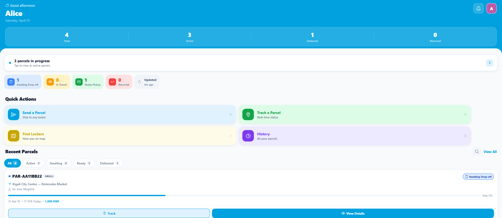 | 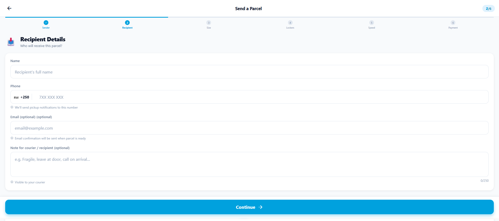 | 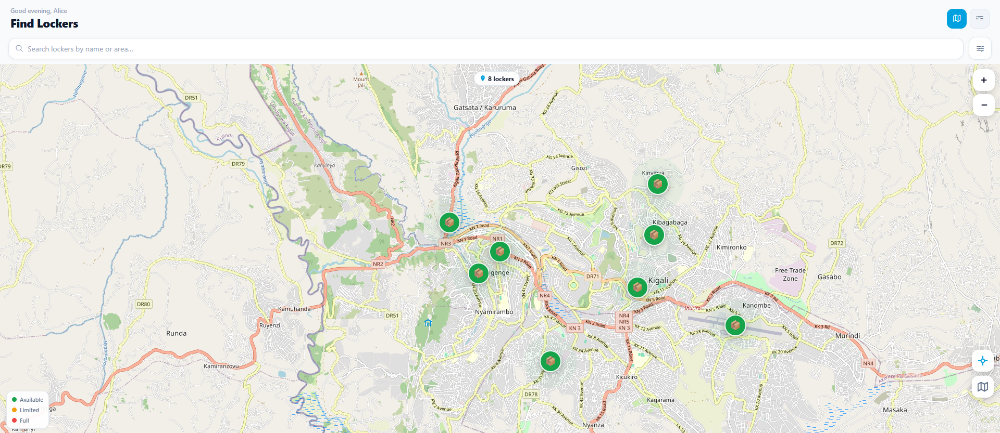 |

| QR Code Drop-off | Track a Parcel | Profile |
|---|---|---|
| 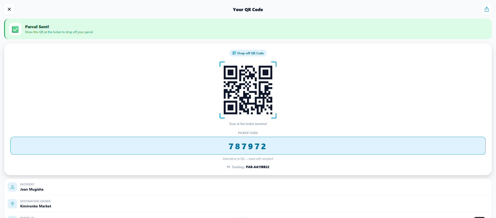 | 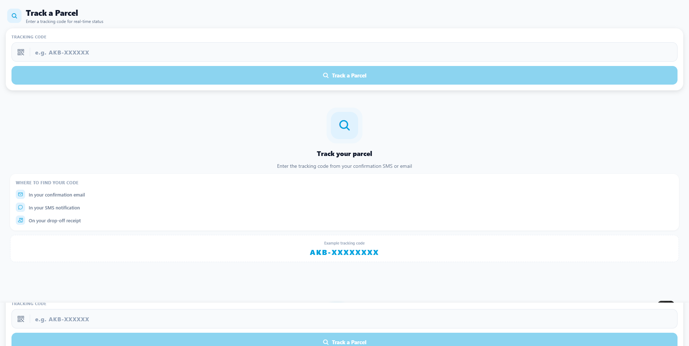 | 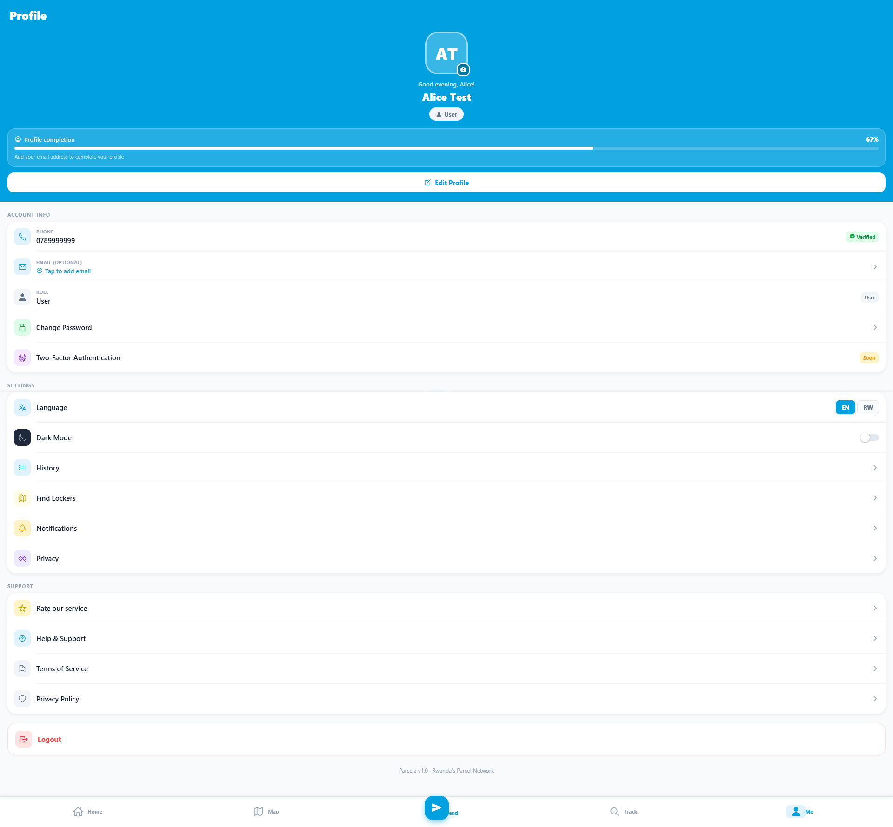 |

### Courier App

| Courier Dashboard | Task Detail |
|---|---|
| 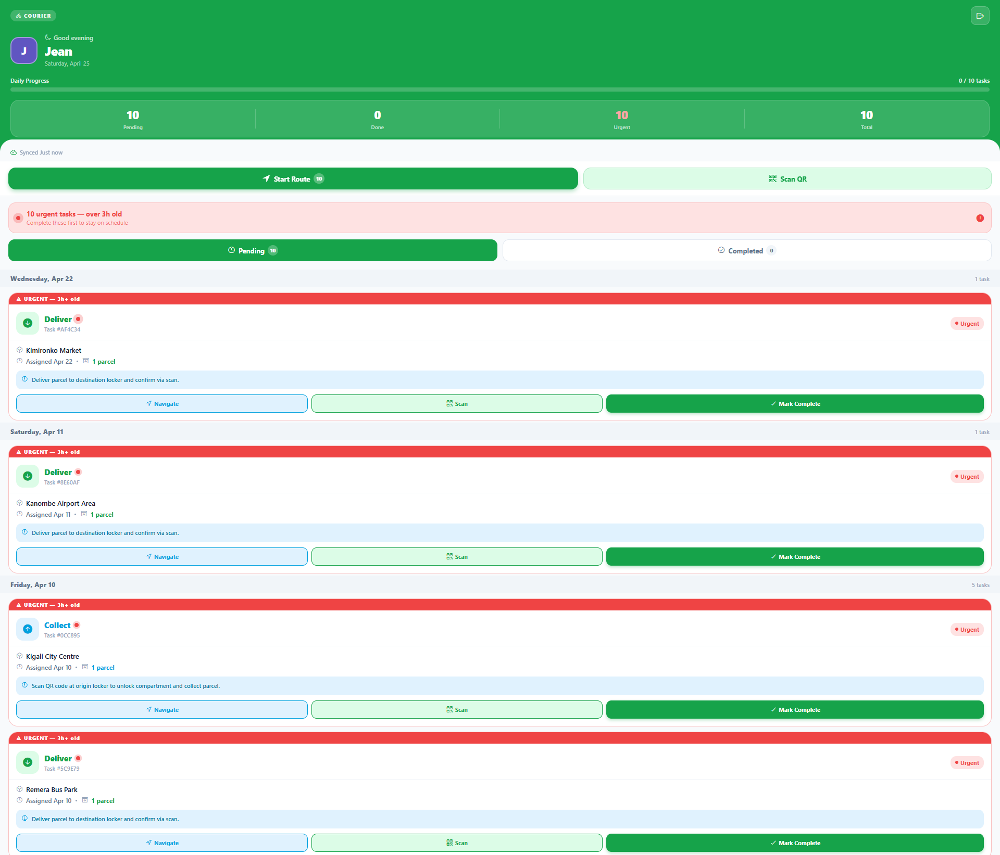 | 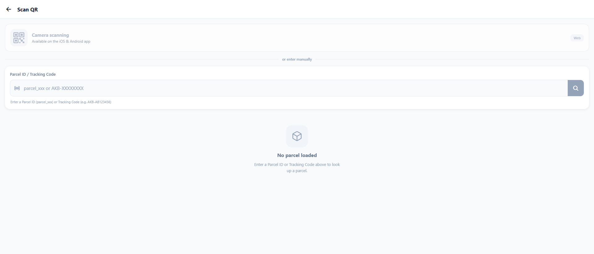 |

### Admin Panel

| Dashboard Overview | Locker Management | User Management | Parcel List |
|---|---|---|---|
| 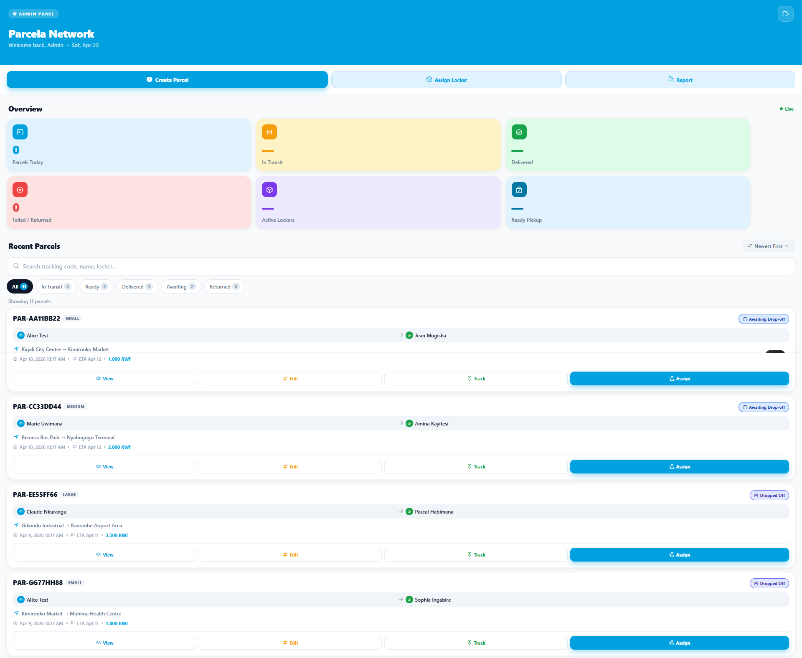 | 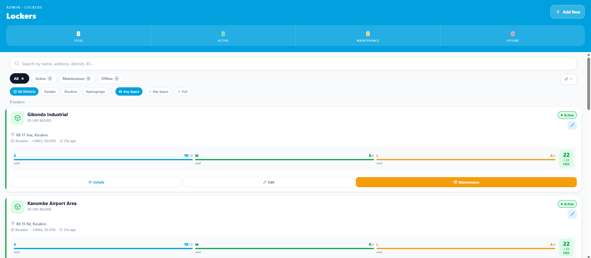 | 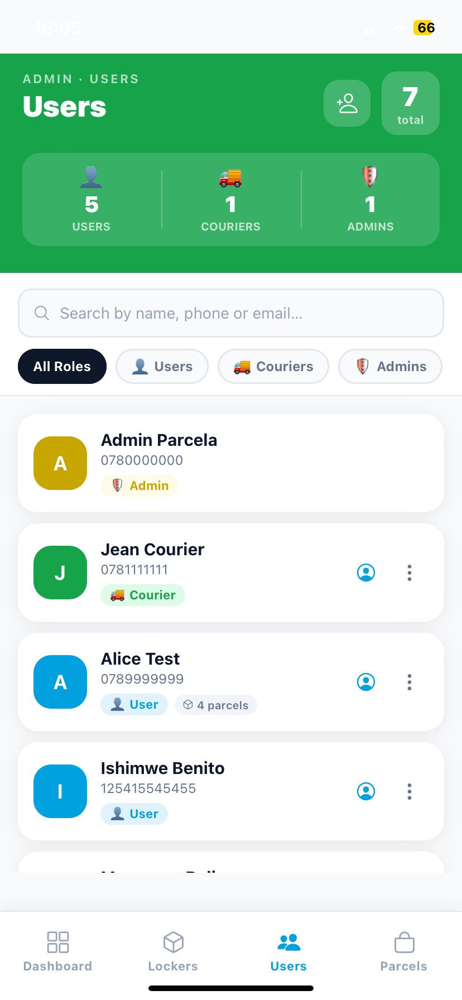 | 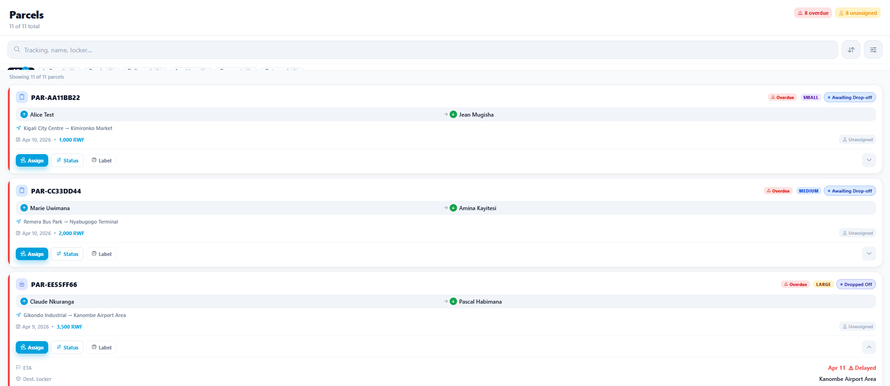 |

---

## Key Features

### For Senders (Users)
- **Send parcels** between any two locker stations across Rwanda
- **Choose parcel size** (Small / Medium / Large) and **delivery speed** (Basic 2–3 days / Fast next morning / Express 30 min–1 hour)
- **Pay via mobile money** — MTN MoMo or Airtel Money directly from the app
- **QR code drop-off** — receive a QR code after payment; scan it at the locker to open the correct compartment
- **Real-time tracking** by tracking code (public, no login required)
- **Full parcel history** with status filters (Active, Awaiting, Ready, Delivered, Returned)
- **Push notifications** for every status change
- **Find Lockers** — searchable list and interactive map showing availability by size

### For Couriers
- **Task dashboard** showing pending collect and deliver assignments, grouped by date
- **Navigate to locker** with one tap
- **QR code scanner** to verify parcel pickup/drop-off at each locker
- **Mark complete** to update task and parcel status in real time
- Urgent flag for overdue tasks

### For Admins
- **Analytics dashboard** — parcels today, in transit, delivered, active lockers, ready for pickup
- **Locker management** — create, edit, toggle active/maintenance/offline, monitor compartment availability
- **Parcel management** — view all parcels, update status, assign couriers, generate labels
- **User management** — list all users/couriers/admins, change roles, view activity and recent parcels
- **Courier task creation** — assign collect or deliver tasks to couriers

### System-Wide
- **Multi-language support** — English and Kinyarwanda (Kinyarwanda via AI translation)
- **Dark mode** toggle
- **Role-based access control** — User, Courier, Admin roles enforced on both frontend and backend
- **Google OAuth** sign-in alongside phone/email login
- **Two-factor authentication** support via Supabase

---

## Local Development Setup

### Prerequisites

- **Node.js** 20+ and **Yarn** 1.22+
- **Java 21** (JDK)
- **Maven** 3.9+
- **Expo CLI**: `npm install -g expo-cli`
- A **Supabase** project (free tier works)
- An **MTN MoMo** sandbox account (optional for payment testing)
- An **Anthropic API key** (optional for translation)

---

### 1. Clone the Repository

```bash
git clone <repository-url>
cd Akabati
```

### 2. Backend Setup

```bash
cd backend
```

Create `src/main/resources/application.properties` (copy from `.example` if present):

```properties
# Server
server.port=8080

# Database — Supabase PostgreSQL connection pooler
spring.datasource.url=jdbc:postgresql://<your-supabase-host>:6543/<database>?pgbouncer=true
spring.datasource.username=<db-user>
spring.datasource.password=<db-password>
spring.jpa.hibernate.ddl-auto=validate

# Supabase Auth
supabase.jwt.jwks-uri=https://<your-project-ref>.supabase.co/auth/v1/keys
supabase.url=https://<your-project-ref>.supabase.co
supabase.service-role-key=<your-service-role-key>

# Admin seed user
admin.email=<your-admin-email>

# MTN Mobile Money (optional)
mtn.momo.base-url=https://sandbox.momodeveloper.mtn.com
mtn.momo.subscription-key=<subscription-key>
mtn.momo.api-user=<api-user-uuid>
mtn.momo.api-key=<api-key>
mtn.momo.environment=sandbox

# Anthropic (optional — for translation)
anthropic.api.key=<your-anthropic-api-key>
```

Run the backend:

```bash
mvn spring-boot:run
```

The API will start on `http://localhost:8080`.

---

### 3. Frontend Setup

```bash
cd frontend
yarn install
```

Create `frontend/.env`:

```env
EXPO_PUBLIC_SUPABASE_URL=https://<your-project-ref>.supabase.co
EXPO_PUBLIC_SUPABASE_ANON_KEY=<your-supabase-anon-key>
EXPO_PUBLIC_API_BASE_URL=http://localhost:8080
```

Start the development server:

```bash
yarn start          # Expo Dev Server (choose platform below)
yarn android        # Android emulator
yarn ios            # iOS simulator (macOS only)
yarn web            # Web browser
```

---

## API Endpoints

Full documentation: [docs/API.md](docs/API.md)

### Auth — `/api/auth`

| Method | Path | Description | Auth |
|---|---|---|---|
| POST | `/api/auth/signup` | Register a new user | No |
| POST | `/api/auth/login` | Login with phone/email + password | No |
| POST | `/api/auth/google/callback` | Complete Google OAuth sign-in | No |
| GET | `/api/auth/me` | Get the authenticated user's profile | JWT |
| POST | `/api/auth/logout` | Invalidate the current session | JWT |

### Parcels — `/api/parcels`

| Method | Path | Description | Auth |
|---|---|---|---|
| POST | `/api/parcels` | Create a new parcel | JWT |
| GET | `/api/parcels/my` | List the authenticated user's parcels | JWT |
| GET | `/api/parcels` | List all parcels | JWT |
| GET | `/api/parcels/{parcelId}` | Get parcel detail | JWT |
| GET | `/api/parcels/track/{trackingCode}` | Track parcel by code | **No** |
| GET | `/api/parcels/by-user/{userId}` | Get parcels by user ID | No |
| POST | `/api/parcels/{parcelId}/payment` | Initiate mobile money payment | JWT |
| GET | `/api/parcels/{parcelId}/payment-status` | Poll payment status | JWT |
| PUT | `/api/parcels/{parcelId}/status` | Update parcel status | JWT (Courier/Admin) |
| POST | `/api/parcels/{parcelId}/scan` | Process courier QR scan | JWT (Courier) |
| POST | `/api/parcels/{parcelId}/assign` | Assign parcel to courier task | JWT (Admin) |

### Lockers — `/api/lockers`

| Method | Path | Description | Auth |
|---|---|---|---|
| GET | `/api/lockers` | List all active lockers | No |
| GET | `/api/lockers/{lockerId}` | Get locker detail | No |
| POST | `/api/lockers` | Create a new locker | JWT (Admin) |
| PUT | `/api/lockers/{lockerId}` | Update locker details | JWT (Admin) |
| DELETE | `/api/lockers/{lockerId}` | Delete a locker | JWT (Admin) |

### Couriers — `/api/courier`

| Method | Path | Description | Auth |
|---|---|---|---|
| GET | `/api/courier/tasks` | Get the authenticated courier's tasks | JWT (Courier) |
| GET | `/api/courier/tasks/by-courier/{courierId}` | Get tasks by courier ID | No |
| PUT | `/api/courier/tasks/{taskId}` | Update task status | JWT (Courier) |

### Admin — `/api/admin`

| Method | Path | Description | Auth |
|---|---|---|---|
| GET | `/api/admin/stats` | System-wide dashboard statistics | JWT (Admin) |
| GET | `/api/admin/lockers` | List all lockers (incl. inactive) | JWT (Admin) |
| GET | `/api/admin/users` | List all users | JWT (Admin) |
| GET | `/api/admin/couriers/{courierId}/tasks` | Get a courier's tasks | JWT (Admin) |
| POST | `/api/admin/courier-tasks` | Create a courier task | JWT (Admin) |
| PUT | `/api/admin/users/{userId}/role` | Change a user's role | JWT (Admin) |

### Notifications — `/api/notifications`

| Method | Path | Description | Auth |
|---|---|---|---|
| GET | `/api/notifications` | List the current user's notifications | JWT |
| PUT | `/api/notifications/{notificationId}/read` | Mark notification as read | JWT |
| PUT | `/api/notifications/read-all` | Mark all notifications as read | JWT |

### Other

| Method | Path | Description | Auth |
|---|---|---|---|
| POST | `/api/feedback` | Submit feedback with rating | JWT |
| POST | `/api/translate` | Translate text (via Claude AI) | No |
| GET | `/api/users` | List all users | No |

---

## Data Models

See [docs/ARCHITECTURE.md](docs/ARCHITECTURE.md) for full entity descriptions.

**Core entities:** `AppUser`, `Parcel`, `Locker`, `CourierTask`, `Notification`

**Parcel statuses:** `awaiting_payment` → `awaiting_dropoff` → `dropped_off` → `in_transit` → `ready_for_pickup` → `delivered` (or `returned`)

---

## Deployment

### Backend

Build a production JAR:

```bash
cd backend
mvn clean package -DskipTests
java -jar target/parcela-backend-1.0.0.jar
```

The app is ready to deploy to any JVM host (Railway, Render, Fly.io, AWS EC2, etc.).

### Mobile App

Build production binaries via Expo EAS:

```bash
cd frontend
eas build --platform android   # APK / AAB for Google Play
eas build --platform ios       # IPA for App Store
eas build --platform all       # Both simultaneously
```

Web build:

```bash
cd frontend
npx expo export --platform web
# Deploy the dist/ folder to any static host (Netlify, Vercel, Cloudflare Pages)
```

---

## Roadmap

- **Real-time SMS notifications** — Trigger SMS alerts at every status change using Africa's Talking or Twilio (SMS provider hooks already stubbed in `SmsService.java`)
- **IoT locker hardware integration** — MQTT or WebSocket bridge to physical locker controllers for real compartment-open/close commands
- **Payment gateway expansion** — Add Equity Bank and Bank of Kigali mobile banking alongside MTN MoMo and Airtel Money
- **Recipient self-pickup without sender account** — Allow anyone to pick up a parcel using just a phone number and pickup code
- **Business/bulk sender dashboard** — Multi-parcel booking, invoice generation, CSV import for high-volume senders
- **Courier performance analytics** — Delivery rate, on-time percentage, customer ratings per courier
- **Locker hardware health monitoring** — Report compartment faults, temperature, and battery status from IoT sensors
- **Returns flow** — End-to-end return parcel workflow with refund processing
- **Offline mode** — Queue parcel scans when connectivity is lost and sync on reconnect
- **Referral and loyalty programme** — Reward frequent senders with discounted deliveries

---

## Contributing

1. Fork the repository
2. Create a feature branch: `git checkout -b feat/your-feature`
3. Commit your changes: `git commit -m "feat: add your feature"`
4. Push and open a pull request

---

## License

This project is licensed under the MIT License — see [LICENSE](LICENSE) for details.

---

*Parcela v1.0 · Rwanda's Parcel Network*
